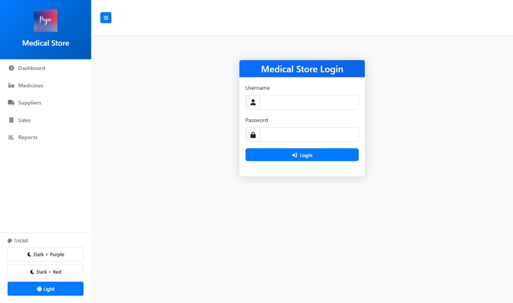
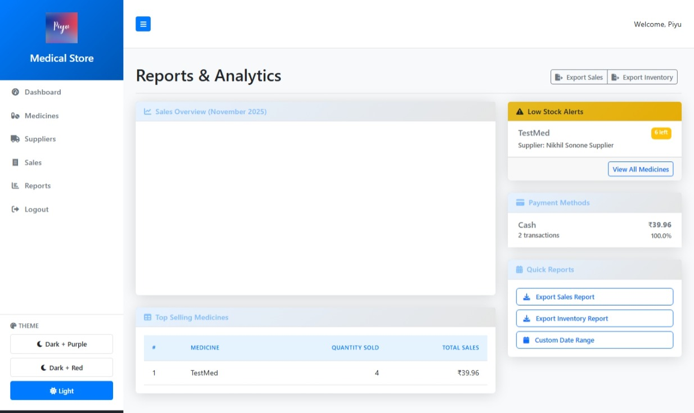
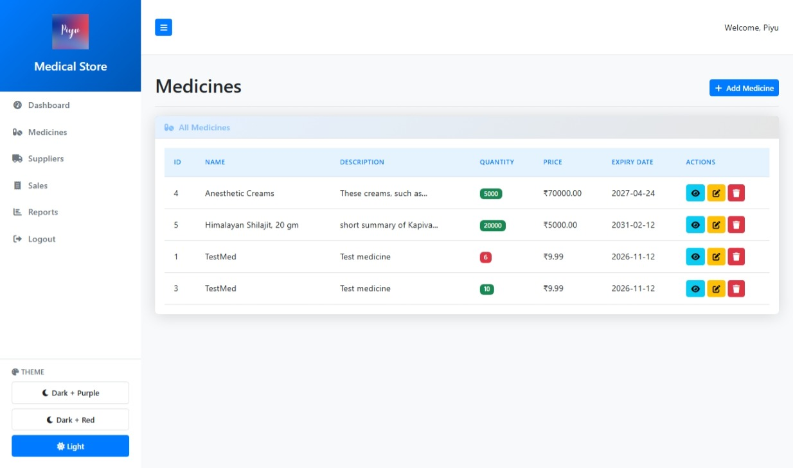
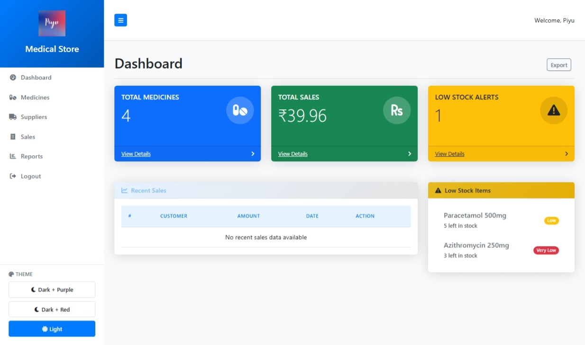

## 🏥 Medical Store Management System

A lightweight, responsive web application designed to streamline operations for small to medium-sized medical stores. Built using **Python (Flask)** for backend logic and **HTML/CSS** for frontend presentation, this system enables efficient management of medicines, suppliers, sales, and reports.

---

### 🚀 Features

- 🔐 **User Authentication** – Secure login/logout system using Flask-Login
- 💊 **Medicine Inventory** – Add, edit, delete, and monitor stock levels
- 📦 **Supplier Management** – Track supplier details and medicine sources
- 💰 **Sales Tracking** – Record transactions and view sales analytics
- 📊 **Reports & Analytics** – Export sales/inventory reports and view top-selling items
- ⚠️ **Low Stock Alerts** – Visual indicators for medicines running low
- 🎨 **Theme Switching** – Light and dark modes with color variants

---

### 🖼️ Screenshots

#### 🔐 Login Page


#### 📊 Reports & Analytics Dashboard


#### 💊 Medicine Inventory Table


#### 📋 Main Dashboard Overview


#### 🧩 Code Overview  


---

### 🛠️ Tech Stack

| Layer        | Technology         |
|--------------|--------------------|
| Backend      | Python, Flask      |
| Frontend     | HTML, CSS          |
| Database     | SQLite             |
| Auth & Security | Flask-Login, Werkzeug |
| Image Handling | Pillow (PIL)      |

---

### 📦 Installation

```bash
# Clone the repository
git clone https://github.com/your-username/medical-store-app.git
cd medical-store-app

# Create virtual environment
python -m venv venv
source venv/bin/activate  # On Windows: venv\Scripts\activate

# Install dependencies
pip install -r requirements.txt

# Run the application
python app.py
```

---

### 📁 Folder Structure

```
medical-store-app/
│
├── static/               # CSS, JS, images
├── templates/            # HTML templates
├── app.py                # Main Flask application
├── medical_store.db      # SQLite database
├── requirements.txt      # Python dependencies
└── README.md             # Project documentation
```

---

### 📌 Future Enhancements

- ✅ Role-based access (Admin vs Staff)
- ✅ Barcode scanning for medicine entries
- ✅ SMS/email alerts for low stock
- ✅ REST API for mobile integration

---

### 👨‍💻 Author

**Piyush Ramteke**  
Final-year BCA student | Project Lead – VidSnapAI & DNEST Interior Design Studio  
🔗 [LinkedIn](https://www.linkedin.com/in/piyush-ramteke) | 📧 piyush@example.com

---

### 📄 License

This project is licensed under the MIT License. Feel free to use, modify, and distribute with attribution.
